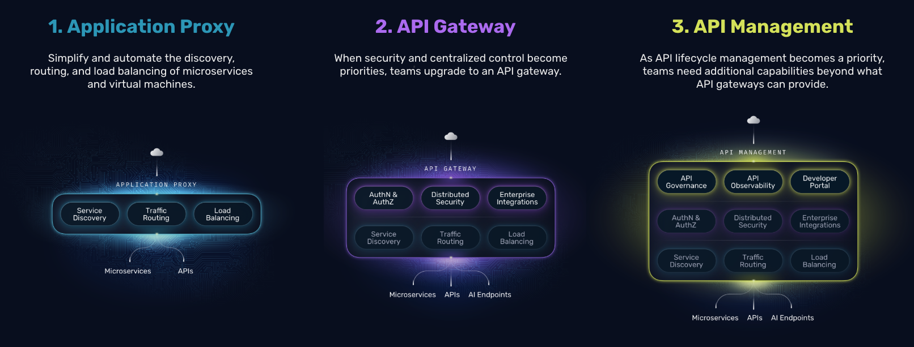

# Traefik OCI Integration Repository

There are different deployment approaches for integrating Traefik with Oracle Cloud Infrastructure (OCI) and Oracle Kubernetes Engine (OKE). In this repository we explore different use cases from the [Traefik API Gateway](https://traefik.io/traefik-hub-api-gateway) and [Traefik API Management](https://traefik.io/solutions/api-management) deployed in OKE.



> Extends the official documentation: https://doc.traefik.io/traefik-hub/operations/oracle-oci/oci-apim-marketplace

---

## Deployment Options

### 1. **API Management** (`traefik_apim/`)
Full-featured solution with developer portal, API plans, and catalog management.

**Features:** Developer Portal, API Plans, Catalog Items, SSO and JWT Auth (more use cases to be added)
**Use Case:** Complete API management

### 2. **API Gateway** (`traefik_apigateway/`)
Lightweight gateway for direct API exposure with JWT authentication.

**Features:** Direct API routing, JWT Auth and Middleware support (more use cases to be added)
**Use Case:** Simple API gateway without management overhead

---

### Choose Your Path
- **Full API Management**: Navigate to [`traefik_apim/`](./traefik_apim/README.md)
- **API Gateway Only**: Navigate to [`traefik_apigateway/`](./traefik_apigateway/README.md)

---

## Repository Structure

```
├── traefik_apim/           # Full API Management
│   ├── README.md
│   ├── resources/          # Kubernetes manifests
│   └── img/               # Documentation images
└── traefik_apigateway/     # API Gateway
    ├── README.md
    └── resources/          # Kubernetes manifests
```

---

## Documentation Links
- [Traefik Hub Documentation](https://doc.traefik.io/traefik-hub/)
- [OCI Integration Guide](https://doc.traefik.io/traefik-hub/operations/oracle-oci/oci-apim-marketplace)
- [External API Guide](https://doc.traefik.io/traefik-hub/api-management/external-api)
