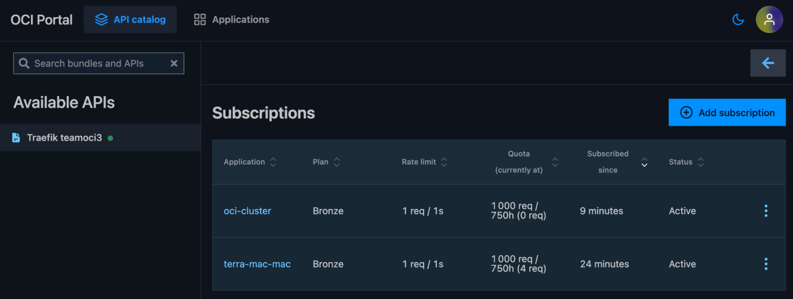

# Integrating Traefik API Management with Oracle Cloud Infrastructure (OCI) and Oracle Kubernetes Engine (OKE)

This document outlines the integration of Traefik with OCI and OKE, focusing on enabling access to external OCI APIs and securing your setup. The deployment differs from the base Traefik Hub Marketplace guide by allowing the use of external services and providing a detailed configuration for API exposure, plans, and access control.

> This is a continuation of the documentation:  
> https://doc.traefik.io/traefik-hub/operations/oracle-oci/oci-apim-marketplace

---

## Enable External APIs

By default, Traefik restricts access to services of type `ExternalName` and cross-namespace references for security reasons. Since this integration involves exposing APIs hosted outside your Kubernetes cluster (such as Oracle Integration Cloud endpoints), you must explicitly enable these features.

You can follow the steps in this guide:  
https://doc.traefik.io/traefik-hub/api-management/external-api

```

helm upgrade --install \
--namespace traefik \
traefik traefik/traefik \
--reset-then-reuse-values \
--set "providers.kubernetesCRD.allowExternalNameServices=true"

```

---

## Example Configuration: Exposing an External API via Traefik with API Plans and Developer Portal

**All referenced YAML files should be placed in your `/resources` folder in your GitHub repository.**

Replace `<EXTERNAL_IP>` with your Load Balancer IP:

```

export EXTERNAL_IP=$(kubectl get svc -n traefik traefik -o jsonpath='{.status.loadBalancer.ingress.ip}')
echo "Use EXTERNAL_IP=${EXTERNAL_IP}"

```

### 1. Service and Routing Setup

#### 1.1 ExternalName Service for the API

Create the namespace:

```

kubectl create namespace apps

```

Apply the service that will expose inside OKE the OCI API, change httpbin.org by your OCI API domain.

```

export EXTERNAL_NAME=httpbin.org
envsubst < resources/1-service.yaml | kubectl apply -f -

```

#### 1.2 IngressRoute for External API

This is the ingress route for your service

```

kubectl apply -f resources/2-route.yaml

```

#### 1.3 Middleware to Strip Prefix

This is the middleware to strip the path prefix from the API and the Portal URL.

```

kubectl apply -f resources/3-middleware.yaml

```

---

### 2. API Definition and Plans

#### 2.1 API Resource for Traefik Hub

Substitute the EXTERNAL_IP with the one from your load balancer and add your OpenAPI specification.

```

export EXTERNAL_IP=$(kubectl get svc -n traefik traefik -o jsonpath='{.status.loadBalancer.ingress.ip}')
echo "Use EXTERNAL_IP=${EXTERNAL_IP}"

export OVERRIDE_SERVER_URL="https://${EXTERNAL_IP}/ociapi"
export OPENAPI_SPEC_URL="https://raw.githubusercontent.com/carlosvillanua/apidefinitions/refs/heads/master/httpbinoas.json"

envsubst < resources/4-api.yaml | kubectl apply -f -

```

#### 2.2 API Plans (Gold and Bronze)

**Redis installation is required for APIPlans to work.**

If possible to re-run the Job from your Stack, follow this part of the manual:  
https://doc.traefik.io/traefik-hub/operations/oracle-oci/oci-apim-marketplace#step-5-create-api-plan

If not, deploy and configure Redis in your cluster and Traefik deployment:

```

helm install redis oci://registry-1.docker.io/bitnamicharts/redis -n traefik --wait
export REDIS_PASSWORD=$(kubectl get secret --namespace traefik redis -o jsonpath="{.data.redis-password}" | base64 -d)
helm upgrade traefik -n traefik --wait \
  --reuse-values \
  --set hub.redis.endpoints=redis-master.traefik.svc.cluster.local:6379 \
  --set hub.redis.password=${REDIS_PASSWORD} \
traefik/traefik

```

Apply the API plans:

```

kubectl apply -f resources/5-apiplans.yaml

```

#### 2.3 Catalog Items to Expose API Plans

```

kubectl apply -f resources/6-catalog-items.yaml

```

---

### 3. Developer Portal Setup

#### 3.1 API Portal Resource

```
export EXTERNAL_IP=$(kubectl get svc -n traefik traefik -o jsonpath='{.status.loadBalancer.ingress.ip}')
echo "Use EXTERNAL_IP=${EXTERNAL_IP}"

export TRUSTED_URL="https://${EXTERNAL_IP}/oci-portal"

envsubst < resources/7-portal.yaml | kubectl apply -f -

```

## 4. Securing Your OCI API with JWT and SSO

To secure your APIs with JWT authentication using OCI as an identity provider, you need to use your `jwks_uri`, which is found in your IdP’s `/.well-known/openid-configuration` endpoint, for example:

```

https://idcs-....4447.identity.oraclecloud.com/admin/v1/SigningCert/jwk

```

Add this URI in the Traefik Hub ([https://hub.traefik.io](https://hub.traefik.io)) Auth Settings configuration:

- Go to **Auth settings → Gateway → JWT**


- Set the Token validation method to **JWKs URL**
- Paste your `jwks_uri` in the field provided and Save


This will configure Traefik Hub to validate JWTs issued by OCI, ensuring only properly authenticated requests reach your APIs.

### Enable Single Sign-On (SSO) for your APIs

To enable SSO, configure Traefik Hub to use OCI as an external OIDC Identity Provider:

- In Auth settings, select the OIDC option in the Portal table.


- Fill out the form with:
  - **Issuer URL:** The OIDC discovery URL from OCI (ends with `/.well-known/openid-configuration`)
  - **Client ID and Client Secret:** From your OCI application registration.
  - **Scopes:** At minimum `openid`; recommended: `email profile`.
  - (Optional) Map claims for groups, user ID, email, etc., as needed for access control and user identification.

In your OCI console you will need to add the Redirect URL:

```

https://<EXTERNAL_IP>/oci-portal/callback

```


After saving, Traefik Hub will:

- Switch the API Portal login to your OCI IdP, enabling SSO for users.


- Require JWT tokens issued by OCI for API access (API keys will be disabled automatically).

For more details and advanced configuration, refer to the official documentation:  
https://doc.traefik.io/traefik-hub/authentication-authorization/idp/oidc

---

## 5. Testing the API via the Portal

- Log into your API Portal:  
  `https://<EXTERNAL_IP>/oci-portal` and sign in using your SSO account.


### 5.1 Create an application in the API Portal

- Click on the **Applications** tab and click on **Create application**


- Add a name and the `Application_id` (for OCI, this will be the `Client_id` creating the JWT and included as a claim in the JWT. You can confirm the `client_id` using JWT.io and one of your JWT tokens.)


### 5.2 Create a subscription in the API Portal

- Click on “Add subscription” and select the plan that you want to have.



- Select an application to use and the plan.


### 5.3 Test the API using the portal

- Get a JWT from your IdP and test out your APIs in the API Portal


---

## Summary

- Enable external API routing by configuring Traefik with the required Helm flags.
- Deploy the provided manifests to expose and secure your external APIs via Traefik on OKE.
- Configure authentication using OCI's OIDC integration for robust security.

For further details on the base setup, refer to the [Traefik Hub documentation for OCI](https://doc.traefik.io/traefik-hub/operations/oracle-oci/oci-apim-marketplace).
